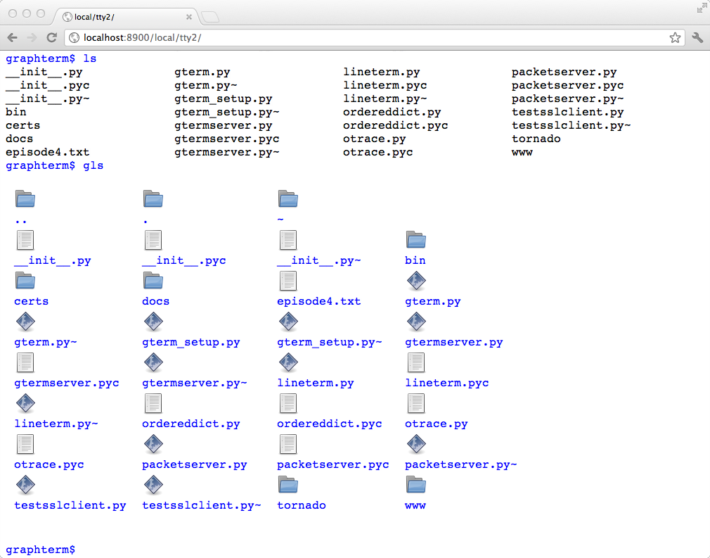
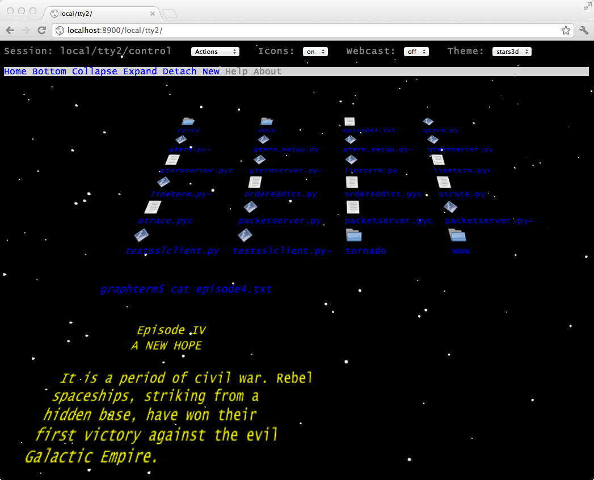
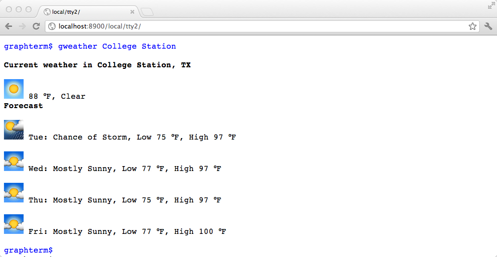
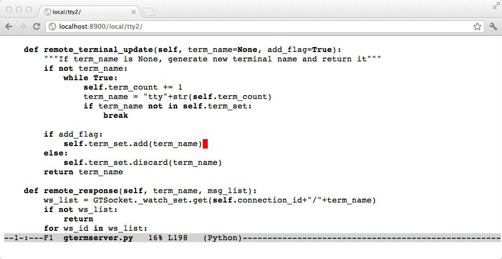
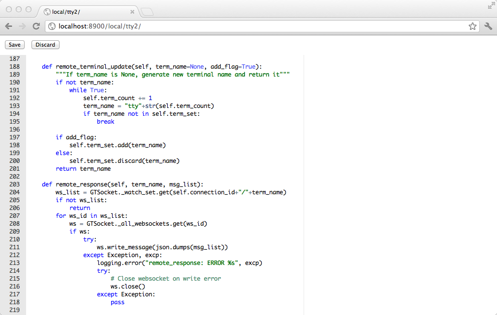
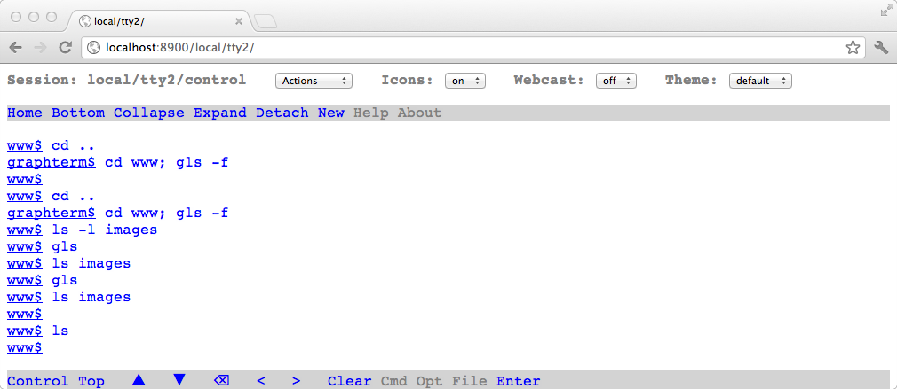
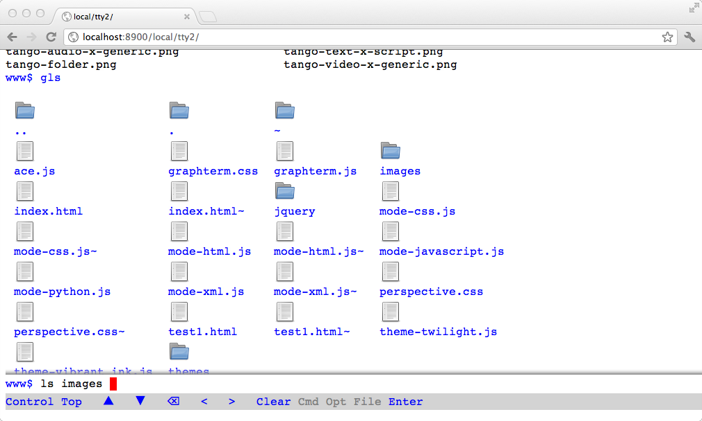

GraphTerm Screenshots
*********************************************************************************
.. sectnum::
.. contents::

ls vs. gls
==================================================

   Comparing plain vanilla ``ls`` command and the graphterm-aware ``gls``.
   The icons and the blue filenames are clickable. (The icon display
   is optional, and may be disabled.)

   ..

.. raw:: html

   

stars3d theme, with icons enabled
==================================================

   Showing output of the ``cat episode4.txt`` command below the
   output of the ``gls`` command, using the 3D  perspective theme. 
   This is actually a working theme, although it is meant for
   primarily for "show". Scrolling through a large text file using the
   ``vi`` editor in this theme gives a nice *roller coaster* effect!
   (This screenshot was captured with Google Chrome running on
   Mac OS X Lion, which supports hidden scrollbars. On other
   software platforms, the scrollbar will be visible.)

   ..

.. raw:: html

   

Graphical weather forecast (using Google Weather API)
=========================================================

   Showing the screen for the command ``gweather College Station`` to
   illustrate inline HTML display. If the location is omitted, a HTML
   form will be displayed to enter the location name.

   ..

.. raw:: html

   

Text editing (emacs)
==================================================

   Showing the screen for the command ``emacs gtermserver.py`` to
   illustrate backwards compatibility with the traditional terminal interface.

   ..

.. raw:: html

   

Graphical code editing using a "cloud" editor
==================================================

   Showing the screen for the command ``gvi gtermserver.py`` to
   illustrate graphical editing using the Ajax.org Cloud9 editor (ACE).

   ..

.. raw:: html

   

Collapsed mode
==================================================

   Showing the screen when all command output is collapsed. Clicking
   on any of the underlined prompts will display the command output.
   Also note  the *Bottom menubar*, which is enabled by clicking on
   the last prompt. Clicking on *Control* and then any of the prompts
   will cause the corresponding command to be pasted.

   ..

.. raw:: html

   

Split scrolling
==================================================

   Showing the split-screen scrolling mode, where the command
   line is anchored at the bottom of the screen. Clicking on ``gls``
   output will paste filenames into the command line.

   ..

.. raw:: html

   

